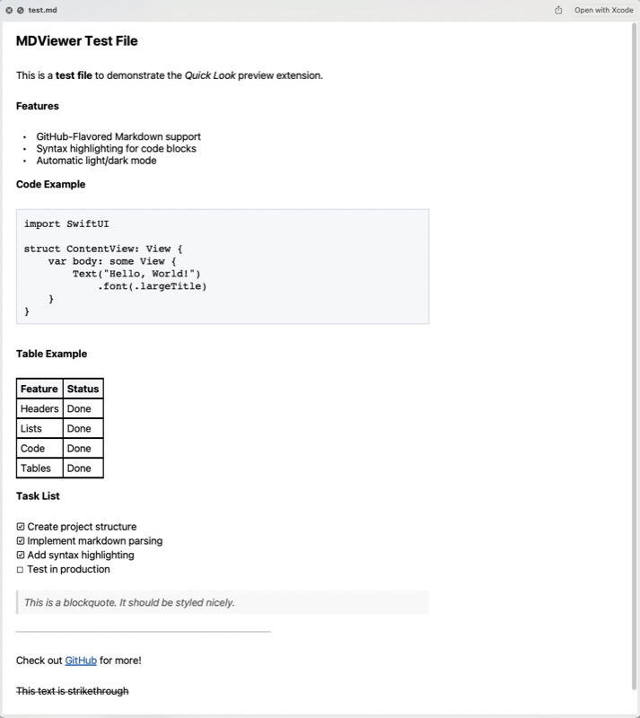

# QLMarkdown

A macOS Quick Look extension for previewing Markdown files. Press Space on any `.md` file in Finder to see rendered Markdown instantly.




## Features

- **GitHub-Flavored Markdown** support
- Headers, bold, italic, strikethrough
- Code blocks with syntax highlighting
- Tables, blockquotes, lists
- Task lists with checkboxes
- Links and images

## Installation

### Build from Source

Requires Xcode 15+ and macOS 13+.

1. Clone the repository:
   ```bash
   git clone https://github.com/tnats/QLMarkdown.git
   cd QLMarkdown
   ```

2. Install [XcodeGen](https://github.com/yonaskolb/XcodeGen) if you don't have it:
   ```bash
   brew install xcodegen
   ```

3. Generate the Xcode project:
   ```bash
   xcodegen generate
   ```

4. Build and install:
   ```bash
   xcodebuild -project QLMarkdown.xcodeproj -scheme QLMarkdown -configuration Release build
   cp -R ~/Library/Developer/Xcode/DerivedData/QLMarkdown-*/Build/Products/Release/QLMarkdown.app /Applications/
   ```

5. Launch the app once to register the Quick Look extension:
   ```bash
   open /Applications/QLMarkdown.app
   ```

6. You can quit the app - the extension runs independently.

## Usage

1. Select any `.md` file in Finder
2. Press **Space** to preview
3. See rendered Markdown instantly

## Troubleshooting

If previews aren't working:

```bash
# Reset Quick Look
qlmanage -r cache
qlmanage -r

# Check if extension is registered
pluginkit -mAvvv -p com.apple.quicklook.preview | grep -i markdown
```

## License

MIT License - see [LICENSE](LICENSE) for details.
